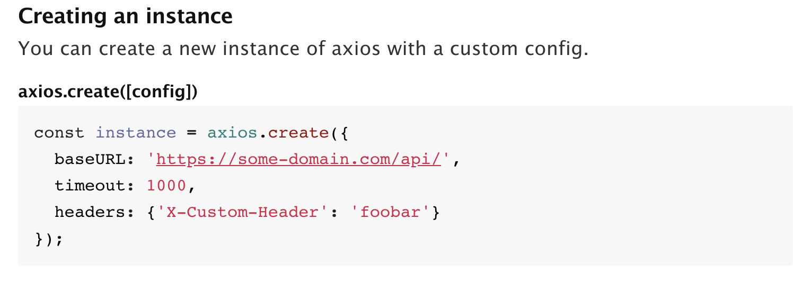
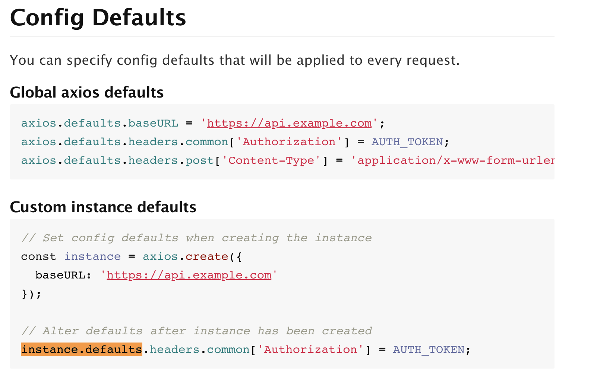

## 问题描述

>发现问题：客服反映用户下单后，有时无法完成支付。


## 复现问题

>复现问题：发现有时下单后支付提示失败，但在当前刷新后，就可以正常完成支付流程。

## 做了什么

>本次迭代内容：一年前的项目需要添加新的业务需求，后端多了一套不同域名的 API 。所以前端新建了 newApi.js ， 通过 axios.create({}) 创建了一个实例，并配置了默认配置。

## 排查问题

>首先去发现问题的地方去复现问题；
>然后查看调用支付接口的参数与返回结果是否有误；
>发现支付请求失败时，支付接口 http 的请求头 Content-Type 字段为 "application/json"，而不是约定的 'application/x-www-form-urlencoded'；
>找到出错原因，聚焦代码中涉及 "application/json" 的地方；
>找到涉及 "application/json" 的配置，如下代码：

index.js 原来的配置文件

```javascript
...
const API_HOST = process.env.API_ROOT;

axios.defaults.baseURL = API_HOST;
axios.defaults.headers.post['Content-Type'] = 'application/x-www-form-urlencoded';
...
```

newApi.js 新添加的配置文件

```javascript
...
const API_HOST = process.env.New_API_ROOT;

const instance = axios.create({
  baseURL: API_HOST,
  timeout: 1000,
});

instance.defaults.headers.post['Content-Type'] = 'application/json';
...
```


## 解决问题

 1. 查看 [axios](https://www.npmjs.com/package/axios) 的 create() 方法，`你可以配置一个新的拥有自定义配置的 axios 实例`，自定义配置涉及 `baseURL`、 `timeout` `headers` 等字段。
查看代码并没有给该实例配置 `headers['Content-Type']` 字段。



 2. 接着查看 [axios](https://www.npmjs.com/package/axios) 的 `instance.defaults.headers.post`，`改变默认在创建实例后`，所以问题就出在这里的配置。



 3. 将 `newApi.js`中的 `instance.defaults.headers.post['Content-Type'] = 'application/json';` 这行代码注释之后，每个请求的配置都会取 `index.js` 中的配置，而不会在调用 `newApi.js` 中的请求后覆盖 `index.js` 中的配置。


## 总结

建议将不同域名的 API 接口以文件为单位，在每个文件内都是用 `axios.create()` 创建一个实例，并给该实例设置配置项，以防不同的接口相互影响各自的配置。

比如：

a.js

```javascript
...
const API_HOST = process.env.A_API_ROOT;

const instance = axios.create({
  baseURL: API_HOST,
  timeout: 1000,
  headers: {
  	'Content-Type': ''application/x-www-form-urlencoded'
  }
});
...
```

b.js

```javascript
...
const API_HOST = process.env.B_API_ROOT;

const instance = axios.create({
  baseURL: API_HOST,
  timeout: 1000,
  headers: {
  	'Content-Type': ''application/x-www-form-urlencoded'
  }
});
...
```

c.js

```javascript
...
const API_HOST = process.env.C_API_ROOT;

const instance = axios.create({
  baseURL: API_HOST,
  timeout: 1000,
  headers: {
  	'Content-Type': ''application/x-www-form-urlencoded'
  }
});
...
```