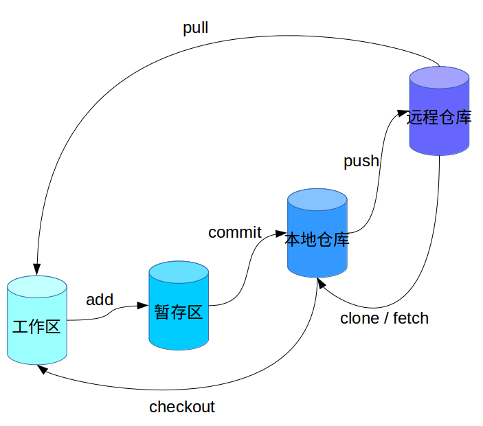

---
# 首次上传现有文件

- 进入要上传的文件夹
	
``` dos?linenums
cd <my-dirname>
```
	
- 初始化，新建一个 git 仓库

``` dos?linenums
git init
```
	
- 将文件从工作区添加到暂存区

``` dos?linenums
git add .
```
	
- 提交，将文件从暂存区提交到本地仓库

``` dos?linenums
git commit -m "first commit"
```

- 增加一个新的远程仓库 origin

``` dos?linenums
git remote add origin <url>
```
	
- 将本地仓库推送到远程仓库 origin 的 master 分支上

``` dos?linenums
git push -u origin master
```
	
	
---
# 文件存放区

## 术语

en | zh
-- | -
workspace | 工作区
index / stage | 暂存区
repository | 本地仓库
remote | 远程仓库


## 简单示意图




---
# 分支

- 查看所有本地分支

``` dos?linenums
git branch
```

- 新建一个分支

``` dos?linenums
git branch [branch-name]
```

- 切换分支，工作区也会更新

``` dos?linenums
git checkout [branch-name]
```

- 分支内操作

``` dos?linenums
git status
git add .
git status
git commit -m "edit this branch files"
git pull origin master
git push --set-upstream origin [current-branch-name]
```

- 切到主分支，合并分支

``` dos?linenums
git checkout master
git merge [branch-name]
git pull
git push
```


---
# 标签

- 查看所有 tag

``` dos?linenums
git tag
```

- 将文件从工作区添加到暂存区

``` dos?linenums
git add .
```

- 在 commit 前（后）打 tag ， 本次 tag 不包含（包含）本次 commit 的文件

``` dos?linenums
git tag [tag-name]
```

- 更新工作区代码

``` dos?linenums
git pull
```

- 提交本次 tag

``` dos?linenums
git push origin [tag-name]
```

- 将本次修改文件从本地仓库提交到远程仓库

``` dos?linenums
git push
```


# 删除未使用 `git add` 缓存的文件，即工作区的修改

- 删除修改文件后的内容

``` dos?linenums
git checkout -- [filename]

or

git checkout [filename]

or

git checkout .
```

- 删除新建的文件，因为新建的文件一般还没有加入到 `git` 中，所以 `git` 是无感知的

``` dos?linenums
rm -rf [filename]
```


# 删除使用 `git add` 缓存到暂存区，但未使用 `git commit` 提交，即暂存区的修改

- 撤销添加文件到缓存区，回到 `git add` 之前的状态，保留工作区的修改内容

``` dos?linenums
git reset HEAD [filename]

or

git reset HEAD .
```


# 删除使用 `git commit` 添加到本地仓库，但未同步到远程仓库

 1. 
	- 查看 `commit` 记录
    
    ``` dos?linenums
	git log
	```
	
	- 返回某次 `commit` 后的版本，不会保留修改的内容

	``` dos?linenums
	git reset --hard [commit]
	```

 2. 
	返回上次 `commit` 后的状态，不会保留修改的内容

``` dos?linenums
git reset --hard HEAD^
```

3. 撤销 `git commit` 操作，回到 `git add` 之前的状态，保留修改的内容

``` dos?linenums
git reset [commit]
```


# 删除远程仓库的提交，或者说是回滚到某一版本

- 查看 `commit` 记录

``` dos?linenums
git log
```

- 回滚到某次 `commit` 后的版本

``` dos?linenums
git reset --hard [commit]
```

- 本地代码回滚，但远程仓库没有，所以可以提交本地覆盖远程仓库

``` dos?linenums
git push origin master --force
```


---
# 回滚

- 查看 commit 的序列号

```dos?linenums
git log
```

- 将本地代码回滚到某一 commit 之前的版本，并在 commit 中添加了一条记录

```dos?linenums
git revert [commit-number]
```

- 同步远程仓库

```dos?linenums
git push
```


---
# 清空分支

- 切换要被清空内容的分支

``` dos?linenums
git checkout [branch-name]
```

- 清空

``` dos?linenums
git rm -rf .
```

- 查看

``` dos?linenums
git status
```

- 添加到暂存区

``` dos?linenums
git add .
```

- 添加到本地仓库

``` dos?linenums
git commit -m "feat():清除该分支内容"
```


---
# 删除分支

- 查看分支

``` dos?linenums
git branch
```

- 查看分支（包括远程分支）

``` dos?linenums
git branch -a
```

- 删除本地分支，请切换到其他分支后操作

``` dos?linenums
git branch -D [branch-name]
```
- 删除远程分支

``` dos
git push origin --delete [branch-name]
```

---
# 实例

## Git global setup

``` dos?linenums
git config --global user.name "jialei"
git config --global user.email "948962131@qq.com"
```

## Create a new repository

``` dos?linenums
git clone 
git@gitlab.com:leijia/website.git

cd website
touch README.md
git add README.md
git commit -m "add README"
git push -u origin master
```

## Existing folder

``` dos?linenums
cd existing_folder
git init
git remote add origin 
git@gitlab.com:leijia/website.git

git add .
git commit -m "Initial commit"
git push -u origin master
```

## Existing Git repository

``` dos?linenums
cd existing_repo
git remote rename origin old-origin
git remote add origin 
git@gitlab.com:leijia/website.git
git push -u origin --all
git push -u origin --tags
```
