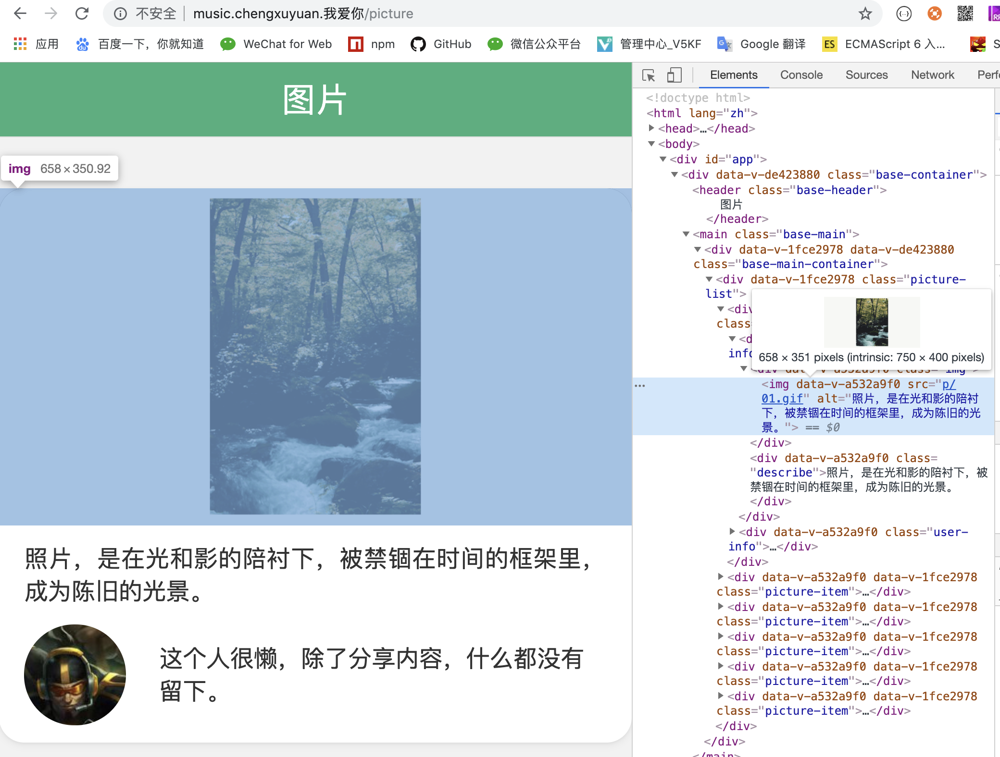
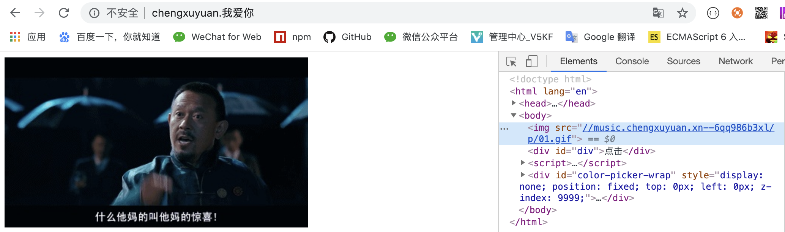

## 效果

>http://music.chengxuyuan.xn--6qq986b3xl/picture 网站下有一些图片跟音视频，如果是 `非 music.chengxuyuan.xn--6qq986b3xl` 站点下引用了该网站的资源链接，就给他返回 [惊喜](http://www.chengxuyuan.xn--6qq986b3xl/fuck.gif)

- 受允许网站，引入图片



- 未授权（不在白名单）的网站引用图片




## 配置

>通过 nginx 配置，匹配 referer 为非目标站点时，返回 [不想让看的内容]

```nginxconf
server{
	listen       80;
	server_name  music.chengxuyuan.xn--6qq986b3xl;
	root         /home/jialei/music.chengxuyuan.我爱你;
	index		index.html;
	
	location ~ .*\.(wma|wmv|asf|mp3|mmf|zip|rar|jpg|gif|jpeg|png|swf|flv)$ {
		valid_referers none blocked music.chengxuyuan.xn--6qq986b3xl;
		if ($invalid_referer) {
			rewrite ^/ http://www.chengxuyuan.xn--6qq986b3xl/fuck.gif;
		}
	}

	location / {
 		try_files $uri $uri/ /index.html;
	}
}
```


## 参考

- [nginx.conf 文件配置参考](https://www.w3cschool.cn/nginx/nginx-d1aw28wa.html)