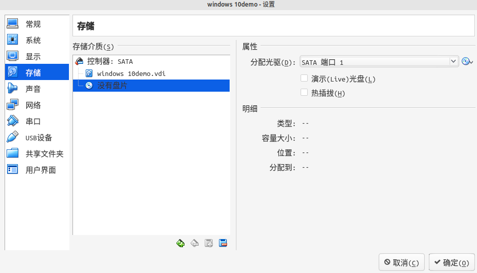
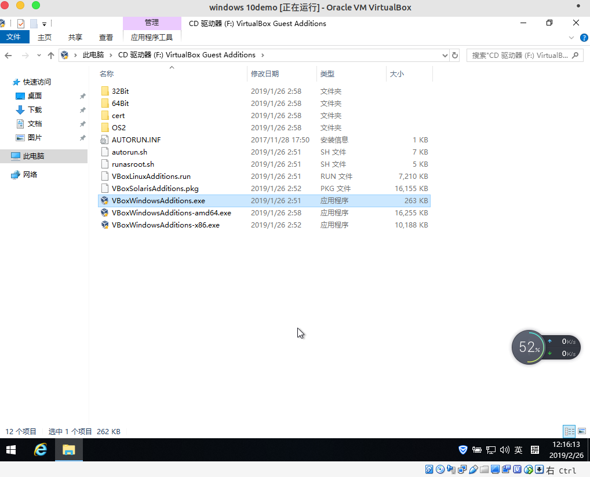

## 安装 virtualbox

- 添加 Oracle VirtualBox 官方仓库

	- 打开源文件
	
	``` dos?linenums
	sudo nano /etc/apt/sources.list
	```
	
	- 向该文件内新增 Oracle VirtualBox 官方仓库

	``` dos?linenums
	deb http://download.virtualbox.org/virtualbox/debian bionic contrib
	```
	
	- 添加 Oracle 公钥

	``` dos?linenums
	wget -q https://www.virtualbox.org/download/oracle_vbox_2016.asc -O- | sudo apt-key add -
	
	or
	
	wget -q https://www.virtualbox.org/download/oracle_vbox.asc -O- | sudo apt-key add -
	```
	
- 更新软件源

``` dos?linenums
sudo apt update
```
	
- 安装 Oracle VirtualBox

``` dos?linenums
sudo apt install virtualbox-5.2
```

- 添加用户到 VirtualBox 组

``` dos?linenums
sudo usermod -aG vboxusers jialei
```

- 查看 virtualbox 内核模块的状态

``` dos?linenums
sudo systemctl status vboxdrv
```


## 安装 VirtualBox 扩展包

- 下载扩展包

```dos?linenums
wget https://download.virtualbox.org/virtualbox/5.2.14/Oracle_VM_VirtualBox_Extension_Pack-5.2.14.vbox-extpack
```

- 安装扩展包

```dos?linenums
sudo VBoxManage extpack install Oracle_VM_VirtualBox_Extension_Pack-5.2.14.vbox-extpack
```


## 使用 VirtualBox 新建 windows 10 虚拟机

- 下载 windows 10 安装包镜像（.iso 文件）

	链接: https://pan.baidu.com/s/1usjC-Iwy8i790ZezuoC6SA 提取码: nezu 复制这段内容后打开百度网盘手机App，操作更方便哦

- 新建虚拟电脑

	- 虚拟电脑名称和系统类型
		- 名称： windows 10
		- 版本： windows 10 (64-bit)

		

	- 下一步 => 内存大小

		
		
	- 下一步 => 虚拟硬盘
		- 选择 现在创建虚拟硬盘

		
		
	- 创建 => 虚拟硬盘文件类型
		- 选择 VDI (VirturlBox 磁盘映像)
		
		
		
	- 下一步 => 存储在物理硬盘上
		- 选择 动态分配

		
		
	- 下一步 => 文件位置和大小

		
		
	- 下一步 => 虚拟硬盘
		- 选择 现在创建虚拟硬盘

- 选择刚才创建好的虚拟电脑 windows 10

	- 启动后，选择下载好的 windows 10 的镜像 （ .iso 文件）
	- 或者在 设置 => 存储 => 没有底片 => 属性 => 分配光驱  选择刚才下载的 windows 10 的镜像（.iso 文件）

		
		
		
		
## 新建 windows 10 虚拟机装 windows 10 系统

- 启动 新建 windows 10 虚拟电脑


- 选择 2 运行 windows PE 微软系统


- 用 磁盘管理工具 分区


- 选择 快速分区，也可以自己去 新建分区


- 快速分区完毕后，退出


- 打开 自动安装系统


- 默认选项，勾选
	- 还原分区
	- Ghost32

- 确定，勾选
	- 完成后重启
	- 引导修复

	

- 是，等待安装完毕


- 安装完毕，自动重启后， 回车 进入（可能会多次这个页面，回车 就好）


- 等待漫长的开机


## 共享粘贴板

- 设置 => 常规 => 高级
	- 共享粘贴板  双向


- 安装 增强功能，聚焦打开的虚拟电脑窗口，在顶部菜单面板的 设备 => 安装增强功能，然后在打开虚拟电脑的 此电脑，安装 CD 驱动器 为 VirtualBox Guest Additions 的软件，默认安装，安装完毕后重启虚拟电脑，就可以共享粘贴板。

	
	
	
	
	
	
	
	
	
	
	
## 拖拽文件

- 设置 => 常规 => 高级 => 拖放 双向，就可以在虚拟机与主机之间通过拖拽文件的方式，将文件复制到目标区域。这种方式容易出错，出错后会影响该功能的使用。建议使用 挂载。


## 挂载

将主机的某一目录，挂载到虚拟机中，实现文件共享。


