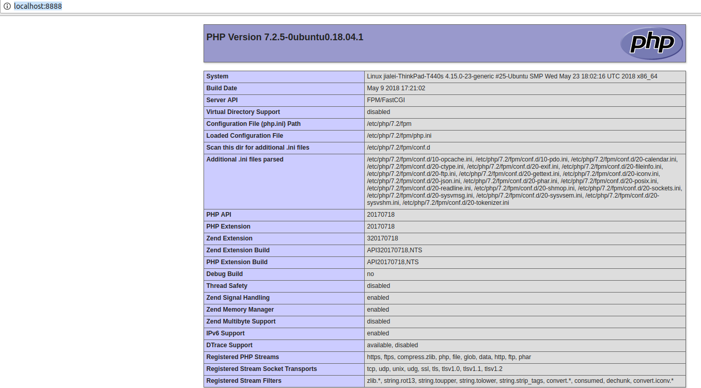

## 配置 php

- 安装 php

	``` dos?linenums
	sudo  apt-get -y install php7.2-fpm
	```

- 修改 php.ini ，将 `;cgi.fix_pathinfo=1` 改为 `cgi.fix_pathinfo=0`

	``` dos?linenums
	sudo vim /etc/php/7.2/cli/php.ini
	```
	
- 重新加载 php7.2-fpm

	``` dos?linenums
	service php7.2-fpm reload
	```
	
	
## 配置 nginx

- 更新包管理器

	``` dos?linenums
	sudo apt-get update
	```
	
- 安装 nginx

	``` dos?linenums
	sudo apt-get install nginx
	```
	
- 新建 nginx 配置文件，注意 `fastcgi_pass unix:/var/run/php/php7.2-fpm.sock;` 中 php

	``` dos?linenums
	sudo vim /etc/nginx/sites-available/jialei.php.conf
	```
	
	``` dsconfig
	server {
			listen 8888;
			listen [::]:8888;

			root /home/jialei/test/php/;

			# Add index.php to the list if you are using PHP
			index index.html index.htm index.nginx-debian.html index.php;

			server_name _;

			location / {
					# First attempt to serve request as file, then
					# as directory, then fall back to displaying a 404.
					try_files $uri $uri/ =404;
			}

			# pass PHP scripts to FastCGI server
			#
			location ~ \.php$ {
				   include snippets/fastcgi-php.conf;

				   # With php-fpm (or other unix sockets):
				   fastcgi_pass unix:/var/run/php/php7.2-fpm.sock;
				   # With php-cgi (or other tcp sockets):
			#       fastcgi_pass 127.0.0.1:9000;
			}

			# deny access to .htaccess files, if Apache's document root
			# concurs with nginx's one
			#
			location ~ /\.ht {
				   deny all;
			}
	}
	```
	
- 将新建的配置文件软链接到 `/etc/nginx/sites-enabled/` 下

	``` dos?linenums
	sudo ln -s /etc/nginx/sites-available/jialei.php.conf /etc/nginx/sites-enabled/
	```
	
- 重启 nginx

	``` dos?linenums
	sudo systemctl restart nginx
	```
	
	
## 运行项目

- 在 nginx 配置的 `root` 目录下 `/home/jialei/test/php/` ，新建文件 index.php

	``` php
	<?php
	phpinfo();
	?>
	```
	
- 访问 [http://localhost:8888/](http://localhost:8888/)

	