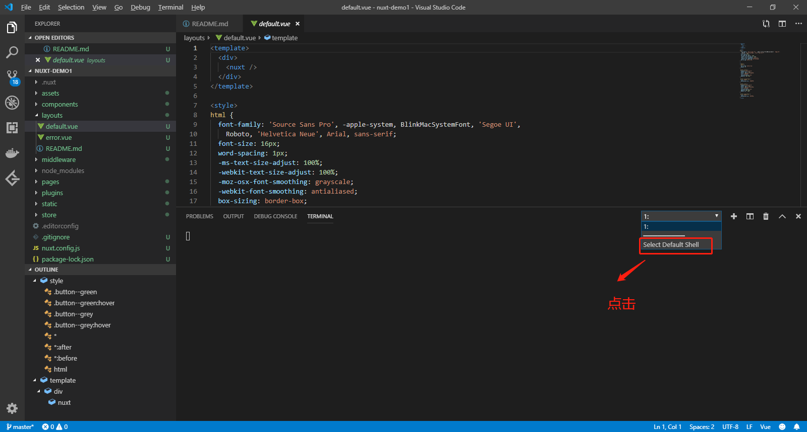
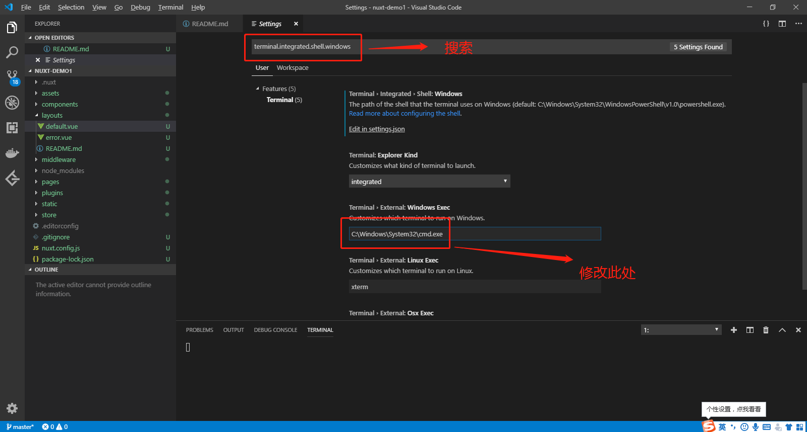

## 安装 git 工具

1. 下载 https://git-scm.com/
2. 安装，自定义目录安装，注意目录不要有中文字符， `D:\software\install`


## 安装 vscode

1. 下载 https://code.visualstudio.com/
2. 安装，自定义目录安装，`D:\software\install`
3. 打开 `vscode`，打开终端工具，选择默认终端 `select default shell`



4. 因为自定义安装 `git` 终端工具，所以默认 `C盘` 没有
5. 打开设置 `settings`，修改默认脚本终端安装地址 `D:\software\install\Git\git-bash.exe`



6. 关闭 `vscode`，重新打开，查看是否配置成功


## vscode 与 vue 的格式化

### 目的

>通过安装 vscode 的扩展 `vetur` 和 npm 包 `@vue/eslint-config-prettier`，在保存文件和格式化文件时格式化代码，已通过 `eslint` 的代码风格检查，方便组内人员统一维护代码。

### 步骤

1. vscode 安装扩展 `vetur`
2. vue 项目安装 npm 依赖包 `@vue/eslint-config-prettier`
3. 配置 `vscode` 的设置文件 `settings.json`

	``` json
	{
	  "eslint.autoFixOnSave": true,
	  "eslint.validate": [
		"javascript",
		"javascriptreact",
		{
		  "language": "vue",
		  "autoFix": true
		}
	  ],
	  "editor.tabSize": 2,
	  "editor.formatOnSave": true,
	  "prettier.semi": false,
	  "prettier.singleQuote": true
	}
	```
	
4. 配置 `package.json` ，追加属性 `prettier`

	``` json
	
	  "prettier": {
		"semi": false,
		"singleQuote": true
	  }
    
	```
	
## 最终 settings.json

``` json
{
	//直接打开 新窗口 "terminal.integrated.shell.windows": D:\\software\\install\\Git\\git-bash.exe
	// or 借用 powershell 窗口，执行 git-bash 
  "terminal.integrated.shell.windows": "C:\\Windows\\System32\\WindowsPowerShell\\v1.0\\powershell.exe",
  "terminal.external.windowsExec": "D:\\software\\install\\Git\\git-bash.exe",
  
  // vue 代码格式化
  "eslint.autoFixOnSave": true,
  "eslint.validate": [
    "javascript",
    "javascriptreact",
    {
      "language": "vue",
      "autoFix": true
    }
  ],
  "editor.tabSize": 2,
  "editor.formatOnSave": true,
  "prettier.semi": false,
  "prettier.singleQuote": true,
  
  //.json 文件格式化 
  "[jsonc]": {
    "editor.defaultFormatter": "esbenp.prettier-vscode"
  },
  "[json]": {
    "editor.defaultFormatter": "esbenp.prettier-vscode"
  }
}

```