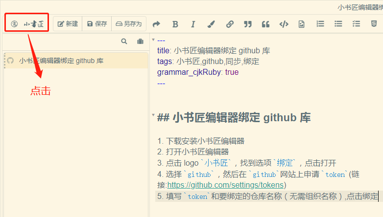
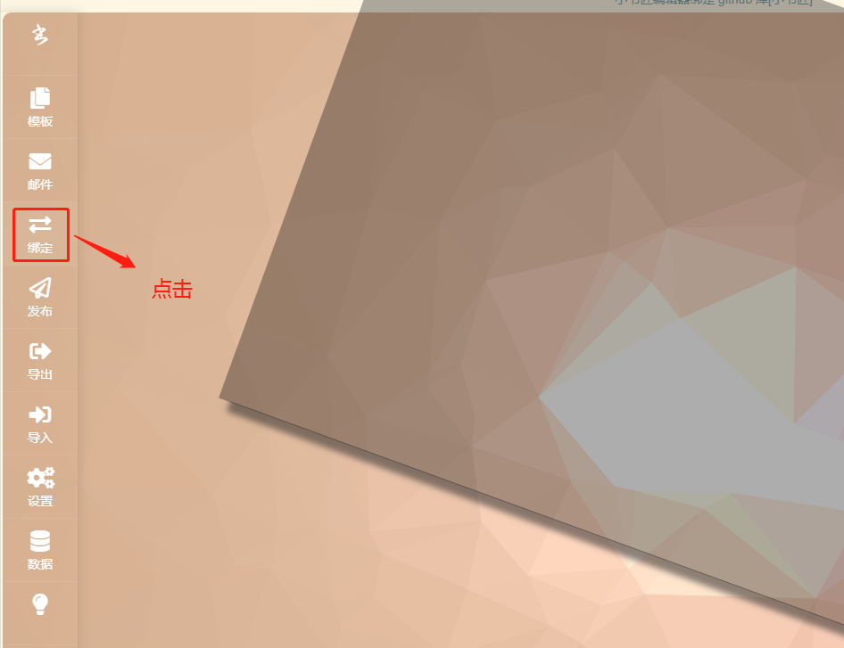
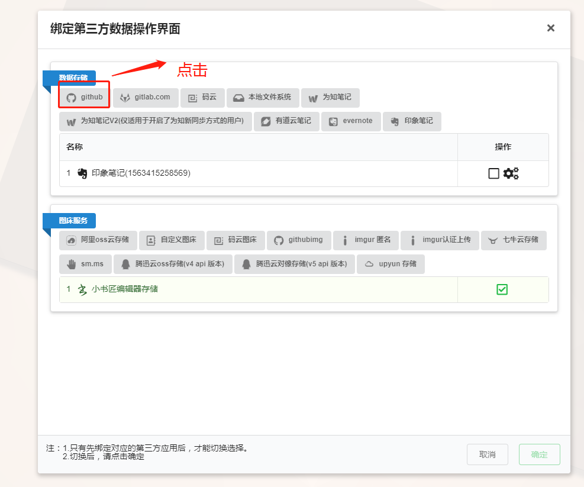
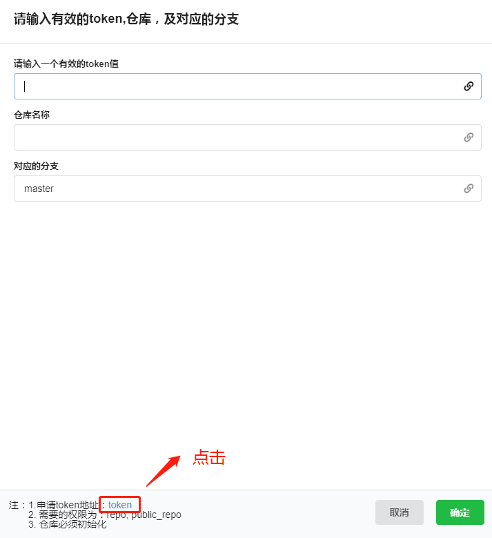
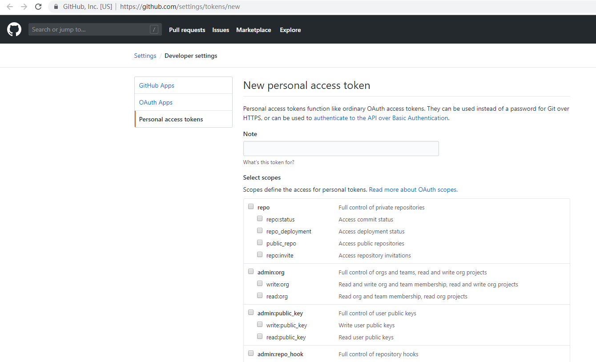

## 小书匠编辑器绑定 github 库

1. 下载安装小书匠编辑器
2. 打开小书匠编辑器
3. 点击 logo `小书匠`，找到选项 `绑定`，点击打开

4. 选择 `github`，然后在 `github`网站上申请 `token`(链接:https://github.com/settings/tokens)

5. 填写 `token`和要绑定的仓库名称（无需组织名称）,点击绑定
