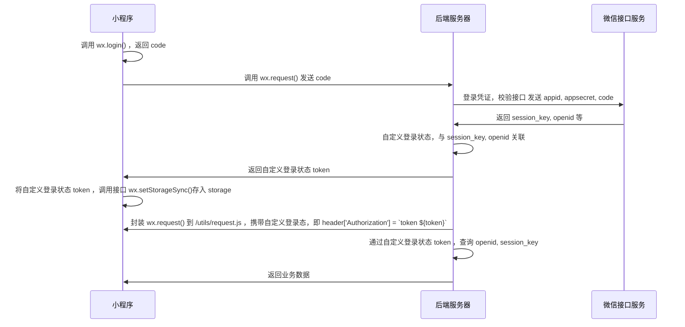
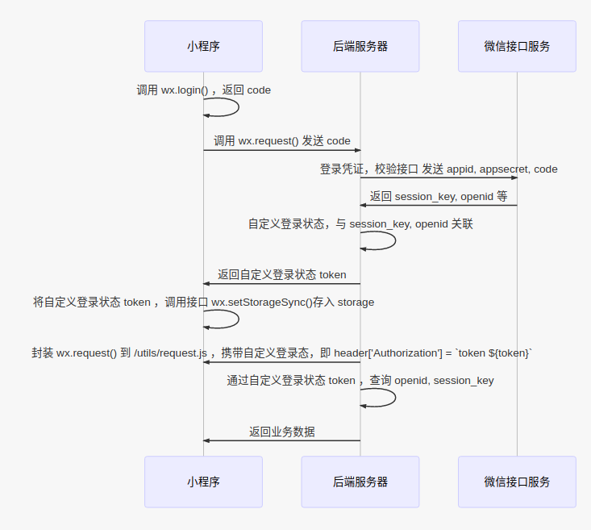

## 聊天界面，新消息展现，页面自动滚动到底部效果

### 思路

>获取 view 组件的默认页面流 Page 的高度，将滚动条向下滚动到这个高度。

### 实现

```javascript
Component({
  /**
   * 组件的属性列表
   */
  properties: {
    msgs: {
      type: Array,
      value: []
    }
  },

  /**
   * 组件的初始数据
   */
  data: {
  },

/**
 * 数据监听
 */
  observers: {
    // 当消息记录列表发生变化
    'msgs': function() {
      // 创建选择器，获取页面的高度，调整滚动
      let sid = setTimeout(() => {
        const query = this.createSelectorQuery()
        let el = query.select('.chat-message')
        el.boundingClientRect((rect) => {
		  //  滚动页面的距离
          wx.pageScrollTo({
            scrollTop: rect.bottom
          })
        }).exec()
        clearTimeout(sid)
      })
    }
  },

  /**
   * 组件的方法列表
   */
  methods: {}
})
```

## 格式化时间

### 思路

>微信小程序提供了 `.wxs` 文件，可以定义一些过滤器，语法与 JS 有所区别，具体请查看[官方文档](https://developers.weixin.qq.com/miniprogram/dev/reference/wxs/)

### 实现

- utils.wxs

```javascript
var utils = {
  // 将分转为元
  numberToRMB: function(number) {
    if (!number) return '0'
    var result = (number / 100).toFixed(2)
    return result
  },

  // 根据 name 寻找数组( [{name:1, value: 'first'}]) 的 value
  findNameValue: function(name, list) {
    if (!list.length) return ''
    for (var i = 0; i < list.length; i++) {
      if (name == list[i].name) return list[i].value
    }
  },

  // 日期格式化
  dateFormat: function(timestamp, format) {
    if (!format) {
      format = "yyyy-MM-dd hh:mm:ss";
    }
    var regYear = getRegExp("(y+)", "i");
    timestamp = parseInt(getDate(timestamp).getTime());
    var realDate = getDate(timestamp);

    function timeFormat(num) {
      return num < 10 ? '0' + num : num;
    }
    var date = [
      ["M+", timeFormat(realDate.getMonth() + 1)],
      ["d+", timeFormat(realDate.getDate())],
      ["h+", timeFormat(realDate.getHours())],
      ["m+", timeFormat(realDate.getMinutes())],
      ["s+", timeFormat(realDate.getSeconds())],
      ["q+", Math.floor((realDate.getMonth() + 3) / 3)],
      ["S+", realDate.getMilliseconds()],
    ];
    var reg1 = regYear.exec(format);
    if (reg1) {

      format = format.replace(reg1[1], (realDate.getFullYear() + '').substring(4 - reg1[1].length));
    }
    for (var i = 0; i < date.length; i++) {
      var k = date[i][0];
      var v = date[i][1];

      var reg2 = getRegExp("(" + k + ")").exec(format);
      if (reg2) {
        format = format.replace(reg2[1], reg2[1].length == 1 ?
          v : ("00" + v).substring(("" + v).length));
      }
    }
    return format;
  },

  numberFormat: function(number) {
    if (!number) return '0'
    var l = number.toString().length,
      result = ''
    if (l >= 4 && l <= 6) {
      result = number / 1000 + '千'
    }
    if (l > 6 && l <= 9) {
      result = number / 1000000 + '百万'
    }
    if (l > 9 && l <= 12) {
      result = number / 1000000000 + '十亿'
    }
    return result
  }
}

module.exports = {
  numberToRMB: utils.numberToRMB,
  findNameValue: utils.findNameValue,
  numberFormat: utils.numberFormat,
  dateFormat: utils.dateFormat
}
```

## 微信登录模块





## 自定义 listenner 文件，自定义事件的监听和触发，完成数据的传递或消息的通知

- listenner.js

``` javascript?linenums
let o = {}

const $on = (eventName, fn) => {
  if(!(eventName in o)) {
    o[eventName] = []
  }
  o[eventName]=[fn]
}

const $emit = (eventName, data) => {
  if(eventName in o) {
    o[eventName].map((fn) => {
      fn(data)
    })
  }
}

const $off = (eventName, fn) => {
  if (eventName in o) {
    if (fn) {
      let index = o[eventName].indexOf(fn);
      if (index > -1) {
        o[eventName].splice(index, 1);
      }
    } else {
      o[eventName].length = 0;
    }
  }
}

export default {
  $on,
  $emit,
  $off
}
```

- app.js

``` javascript?linenums
...
//  自定义事件注册通知
import listenner from '/utils/listenner.js'
wx.$listenner = listenner
...
```