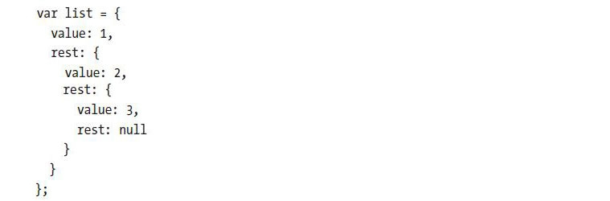
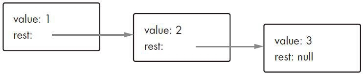

---
## LoopingaTriangle

> 编写一个循环，调用7次console.log函数，打印出如下的三角形
> \#
>  \##
> \###
> \####
> \#####
> \######
> \#######

``` javascript
{
	function consoleTriangle (word, n) {
		var word = word || '#',
			n = parseInt(n) || 7,
			str = ''
			
		for (let i = 0; i < n; i++) {
			str += '#'
			console.log(str)
		}
	}
	
	consoleTriangle('#', 7)
}
```

``` javascript
{
	function consoleTriangle(word, n) {
		var word = word || '#',
			n = parseInt(n) || 7
		
		for (let i = 0; i < n; i++) {
			let str = word.repeat(i + 1)
			console.log(str)
		}
	}

	consoleTriangle('#', 7)
}
```


---
## FizzBuzz

> 编写一个程序，使用 `console.log` 打印出从 1 到 100 的所有数字。不过有两种例外情况：当数字能被 3 整除时，不打印数字，而打印 “Fizz” 。当数字能被 5 整除时（但不能被 3 整除），不打印数字，而打印 “Buzz” 。
当以上程序可以正确运行后，请修改你的程序，让程序在遇到能同时被 3 与 5 整除的数字时，打印出 “FizzBuzz” 。

``` javascript
{
	function fizzBuzz (sn, en) {
		for (let i = sn; i < en + 1; i++) {
			if (i % 3 === 0) {
				console.log("Fizz")
			}

			if ( i % 3 !== 0 && i % 5 === 0) {
				console.log("Buzz")
			}

			console.log(i)
		}
	}

	fizzBuzz(1, 100)
}
```

``` javascript
{
	function fizzBuzz (sn, en) {
		for (let i = sn; i < en + 1; i++) {
			if (i % 3 === 0 && i % 5 === 0) {
				console.log(i,"FizzBuzz")
			}
		}
	}

	fizzBuzz(1, 100)
}
```


---
## 棋盘

>编写一个程序，创建一个字符串，用于表示 8×8 的网格，并使用换行符分隔行。网格中的每个位置可以是空格或字符 “#” 。这些字符组成了一张棋盘。
将字符串传递给 `console.log()` 将会输出以下结果：
当程序可以产生这样的输出后，请定义变量 size=8 ，并修改程序，使程序可以处理任意尺寸（长宽由 size 确定）的棋盘，并输出给定宽度和高度的网格。

``` javascript
{
    function checkerboard(x, y) {
        var x = x || 8,
            y = y || x || 8,
            str = ''

        for (let i = 0; i < x; i++) {
            for (let j = 0; j < y; j++) {
                if (i % 2 === 0) {
                    if (j % 2 === 0) {
                        str += ' '
                    }
                    if (j % 2 !== 0) {
                        str += '#'
                    }
                }

                if (i % 2 !== 0) {
                    if (j % 2 === 0) {
                        str += '#'
                    }
                    if (j % 2 !== 0) {
                        str += ' '
                    }
                }
            }

            console.log(str)
            str = ''
        }
    }

    checkerboard(8, 8)
}
```


---
## 最小值

>标准函数 Math.min() ，它可以返回参数中的最小值。我们自己也可以实现相同的功能。编写一个函数min，接受两个参数，并返回其最小值。

``` javascript
{
	function min (a, b) {
		if (!Number(a) || !Mumber(b)) {
			console.error('Not a Number')
			return false
		}
		return Number(a) <= Number(b) ? a : b
	}
	
	min(1, 2)		// 1
	min(2, 1)		// 1
	min(2, 2)		// 2
	min('2', 1)		// 1
	min('2', 7)		// "2"
}
```


---
## 递归

>我们已经学习过使用%（求余运算符）来判断一个数是否是偶数（即使用%2求数字除以2的余数）。这里有另一种方法来判断一个数字是偶数还是奇数：
·0是偶数
·1是奇数
·对于其他任何数字N，其奇偶性与N－2相同。
根据以上描述，编写一个递归函数isEven。该函数接受一个参数number，并返回一个布尔值。
使用50与75测试该函数。想想如果参数为－1会发生什么以及产生相应结果的原因。请你想一个方法来修正该问题。

``` javascript
{	
	function isEven (n) {
		if (n === 0) return true

		if (n === -1) return false

		if (n < 0) {
			n += 2
		}

		if (n > 0) {
			n -= 2
		}

		return isEven(n)
	}
	
	isEven(50)		// true
	isEven(75)		// false
}
```


---
## 字符计数

>如果我们想要从字符串中获取到第 N 个字符，在字符串后加上 `.charAt(N)` 即可 `"string".charAt(N))` ，类似于使用 `.length` 获取字符串长度。第一个字符的位置是 0 ，因此最后一个字符的位置是 `string.length－1` 。换句话说，包含两个字符的字符串长度为 2 ，但是字符位置只有 0 和 1 。
编写一个函数 countBs ，接受一个字符串参数，并返回一个数字，表示该字符串中有多少个大写字母 “B” 。
接着编写一个函数 countChar ，和 countBs 作用一样，唯一区别是接受第二个参数，指定需要统计的字符（而不仅仅能统计大写字母 “B” ）。并使用这个新函数重写函数 countBs 。

``` javascript
// countBs
{
	function countBs (str) {
		if (typeof str !== 'string') {
			console.error('Not a String')
			return false
		}
	
		let n = 0,
			character = 'B'
		
		for (let i = 0; i < str.length; i++) {
			if (str[i] === character) n++
		}
		
		return n
	}

	countBs('AbcdABcdBBBBB')
}

// countChar
{
	function countChar (str, c) {
		if (typeof str !== 'string' || typeof c !== 'string') {
			console.error('Not a String')
			return false
		}
	
		let n = 0,
			character = c,
			len = c.length
			
		for (let i = 0; i < str.length; i += len) {
			if (str.substr(i, len) === character) n++
		}
		
		return n
	}

	countChar('AbcdABcdBBBBB', 'cdB')
}
```


---
## 特定范围数字求和

>编写一个 range 函数，接受两个参数： start 和 end ，然后返回包含 start 到 end （包括 end ）之间的所有数字。
接着，编写一个 sum 函数，接受一个数字数组，并返回所有数字之和。运行上面的程序，检查一下结果是不是 55 。
附加题是修改 range 函数，接受第 3 个可选参数，指定构建数组时的步数（ step ）。如果没有指定步数，构建数组时，每步按 1 增长，和旧函数行为一致。调用函数 `range(1, 10, 2)` ，应该返回`[1, 3, 5, 7, 9]` 。另外确保步数值为负数时也可以正常工作，因此 `range(5, 2, -1)` 应该产生 `[5, 4, 3, 2]` 。

``` javascript
{
	/*
	* @function range
	* @param start
	* @param end
	* */
	function range (start, end) {
		let arr = []

		for (let i = start; i < end + 1; i++) {
			arr.push(i)
		}

		return arr
	}

	/*
	* @function sum
	* @param arr
	* */
	function sum (arr) {
		let sum = 0

		for (let i = 0; i < arr.length; i++) {
			sum += arr[i]
		}

		return sum
	}

	let arr = range(1, 10)
	sum(arr)
}
```

``` javascript
{
	/*
	* @function range
	* @param start
	* @param end
	* @param step
	* */
	function range (start, end, step) {
		if (!step) step = 1
		
		let arr = []

		for (let i = start; step > 0 ? i < end + 1 : i > end - 1; i += step) {
			arr.push(i)
		}

		return arr
	}
	
	range(1, 10, 2)
	range(5, 2, -1)
}
```


---
## 逆转数组

>数组有一个 `reverse` 方法，它可以逆转数组中元素的次序。在本题中，编写两个函数， `reverseArray` 和 `reverseArrayInPlace` 。第一个函数 `reverseArray` 接受一个数组作为参数，返回一个新数组，并逆转新数组中的元素次序。第二个函数 `reverseArrayInPlace` 与第一个函数的功能相同，但是直接将数组作为参数进行修改来，逆转数组中的元素次序。两者都不能使用标准的 `reverse` 方法。

``` javascript
{
	/*
	* @function reverseArray
	* @param arr
	* */
	function reverseArray (arr) {
		let newArr = []
		
		for (let i = 0; i < arr.length; i++) {
			// newArr.unshift(arr[i])
			let currentElement = arr[arr.length - 1 - i]
			newArr.push(currentElement)
		}
		
		return newArr
	}
}
```

``` javascript
// 先给 Array 对象 的原型链上追加 方法 reverseArrayInPlace
Array.prototype.reverseArrayInPlace = function reverseArrayInPlace () {
	for (let i = 0; i < this.length / 2; i++) {
		let currentElement = this[this.length - 1 - i]

		this[this.length - 1 - i] = this[i]
		this[i] = currentElement
	}

	return this
}

// 添加后可以通过 console.log(Array.prototype) 查看是否有属性 reverseArrayInPlace 对应的 reverseArrayInPlace 方法，如果有，就可以通过 array 实例对象就调用
[1, 2, 5, 4].reverseArrayInPlace()
[1, 2, 5, 4, 7].reverseArrayInPlace()
```


---
## 实现列表

>对象作为一个值的容器，它可以用来构建各种各样的数据结构。有一种通用的数据结构叫作列表（list）（不要与数组混淆）。列表是一种嵌套对象集合，第一个对象拥有第二个对象的引用，而第二个对象有第三个对象的引用，依此类推。
>
>最后产生的对象形成了一条链，如下图所示：
>
>使用列表的一个好处是，它们之间可以共享相同的子列表。举个例子，如果我们新建了两个值： `{value: 0, result: list}` 和 `{value: -1, result: list}` （ `list` 引用了我们前面定义的变量）。这是两个独立的列表，但它们之间却共享了同一个数据结构，该数据结构包含列表末尾的三个元素。而且我们前面定义的 `list` 仍然是包含三个元素的列表。
编写一个函数 `arrayToList` ，当给定参数 `[1, 2, 3]` 时，建立一个和前面示例相似的数据结构。然后编写一个 `listToArray` 函数，将列表转换成数组。再编写一个工具函数 `prepend` ，接受一个元素和一个列表，然后创建一个新的列表，将元素添加到输入列表的开头。最后编写一个函数 `nth` ，接受一个列表和一个数，并返回列表中指定位置的元素，如果该元素不存在则返回 `undefined` 。

``` javascript
{
	/*
	* @function arrayToList
	* @param arr
	* */
	function arrayToList (arr) {
		let list = {}
		
		list.value = arr[0]
		arr.shift()
		
		if (!arr.length) list.rest = null
		
		if (arr.length) {
			list.rest = arrayToList(arr)
		}

		return list
	}
	
	let array = [1, 2, 3]
	arrayToList(array)
	
	/*
	* @function listToArray
	* @param obj
	* */
	function listToArray (obj) {
		let arr = []

		arr.push(obj.value)
		
		while (obj.rest) {
			arr.push(obj.rest.value)
			obj = obj.rest
		}
		
		return arr
	}
	
	let list = {
		value: 1,
		rest: {
			value: 2,
			rest: {
				value: 3,
				rest: null
			}
		}
	}
	listToArray(list)
	
	/*
	* @function prepend
	* @param value
	* @param rest
	* */
	function prepend (value, rest) {
		let list = {}
		
		list = {
			value,
			rest
		}
		
		return list
	}
	
	prepend(4, null)
	
	/*
	* @function nth
	* @param list
	* @param n
	* */
	function nth (list, n) {
		let j = 0
		if (j=== n) return list.value
		
		while (list.rest) {
			j++
			if (j === n) return list.rest.value
			
			list = list.rest
		}
		
		return undefined
	}
	
	let list = {
		value: 1,
		rest: {
			value: 2,
			rest: {
				value: 3,
				rest: null
			}
		}
	}
	nth(list, 2)
}
```


---
## 深度比较

> `==` 运算符可以判断对象是否相等。但有些时候，你希望比较的是对象中实际属性的值。
编写一个函数 `deepEqual` ，接受两个参数，若两个对象是同一个值或两个对象中有相同属性，且使用 `deepEqual` 比较属性值均返回 `true` 时，返回 `true` 。
为了通过类型（使用 `===` 运算符）或其属性比较出两个值是否完全相同，可以使用 `typeof` 运算符。如果对两个值使用 `typeof` 均返回 `"object"` ，则说明你应该进行深度比较。但需要考虑一个例外的情况：由于历史原因， `typeof null` 也会返回 `"object"` 。

``` javascript
{
	/*
	* @function deepEqual
	* */
	function deepEqual (a, b) {
		return JSON.stringify(a) === JSON.stringify(b) ? true : false
	}
}
```