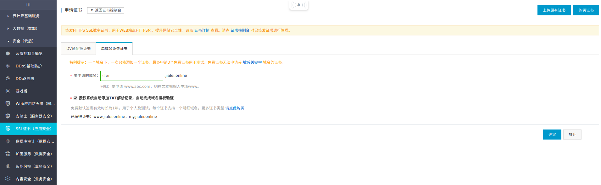
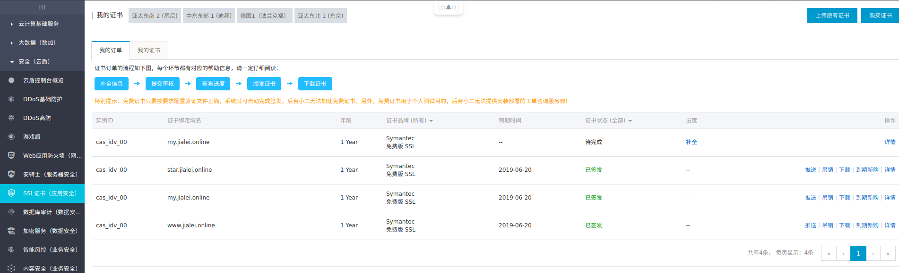
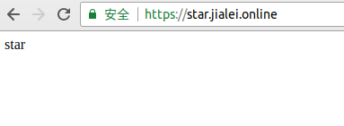

## 先域名解析

- 参考上篇
	- [阿里云域名解析](https://github.com/myArticle/StoryWriter/blob/master/%E9%98%BF%E9%87%8C%E4%BA%91%E5%9F%9F%E5%90%8D%E8%A7%A3%E6%9E%90.md)


## SSL 证书申请

- 申请单域名免费证书
	
	

- 耐心地等待...

- 申请成功

	
	
	
## nginx 配置

- 下载证书

- 为了方便管理，在服务器下创建目录 `/etc/nginx/ssl/star.jialei.online` ，来存放证书

	``` dos?linenums
	sudo mkdir /etc/nginx/ssl/star.jialei.online 
	```
	
- 上传证书，将 `*.pem` 和 `*.key` 文件上传至服务器

	``` dos?linenums
	scp -pr 1530841426226.pem 1530841426226.key [用户]@[外网IP]:/etc/nginx/ssl/star.jialei.online
	```

- 新建项目

	``` dos?linenums
	mkdir /home/jialei/star.jialei.online
	vim index.html
	```

	``` html
	star
	```

- 新建 nginx 配置文件，配置项目地址、访问网址及 SSL 证书

	``` dos?linenums
	sudo vim /etc/nginx/sites-available/star.jialei.online
	```
	
	``` nginx
	server {
		   listen 443;

		   server_name star.jialei.online;

			ssl on;

		   root /home/jialei/star.jialei.online;
		   index index.html;

			ssl_certificate  /etc/nginx/ssl/star.jialei.online/1530841426226.pem;
			ssl_certificate_key  /etc/nginx/ssl/star.jialei.online/1530841426226.key;
			ssl_session_timeout 5m;
			ssl_ciphers ECDHE-RSA-AES128-GCM-SHA256:ECDHE:ECDH:AES:HIGH:!NULL:!aNULL:!MD5:!ADH:!RC4;
			ssl_protocols TLSv1 TLSv1.1 TLSv1.2;
			ssl_prefer_server_ciphers on;

		   location / {
				   try_files $uri $uri/ =404;
		   }
	}
	```
	
- 将配置文件 `/etc/nginx/sites-available/star.jialei.online` 软链到 `/etc/nginx/sites-enabled/` 下

	``` dos?linenums
	sudo ln -s /etc/nginx/sites-available/star.jialei.online /etc/nginx/sites-enabled/
	```
	
- 重启 nginx 服务

	``` dos?linenums
	sudo systemctl restart nginx
	```
	
- 访问 [https://star.jialei.online/](https://star.jialei.online/) ，如下图则代表配置成功

	